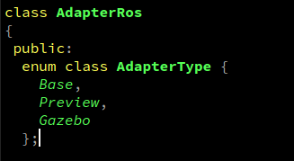
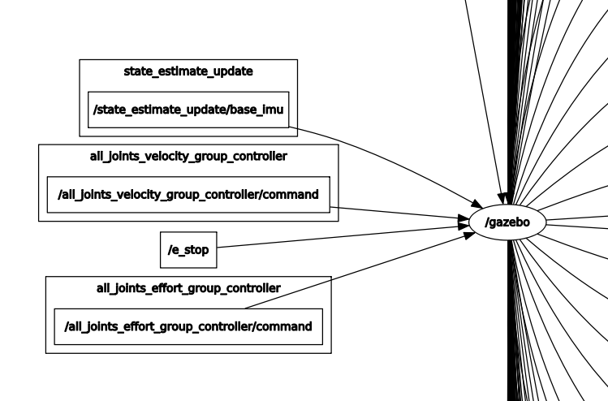
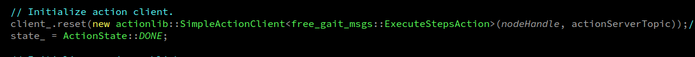
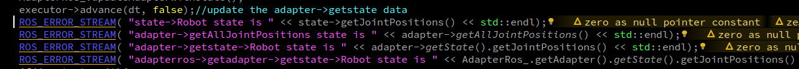
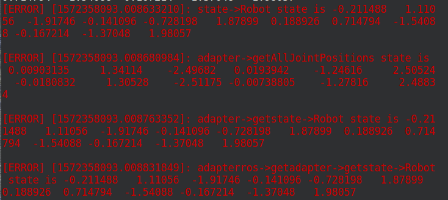
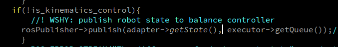
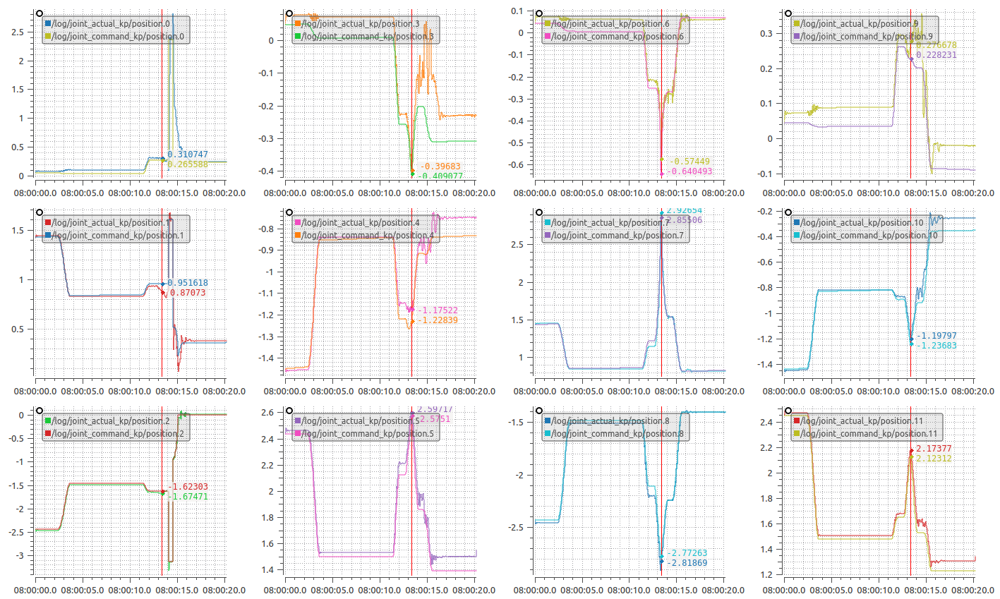

 ###1、JointTrajectory
通过规划关节运动时间和经过的关节点，规划处关节运动曲线，并实现在特定时刻的运动位置、速度、加速度和力矩的反馈。

###2、 Footstep
设置每一步运动所采取的运动步态，三角行，梯形还是其他？设置腿部运动时抬脚速度，触地速度等参数。

###3、BaseAuto
bool BaseAuto::prepareComputation(const State& state, const Step& step, const StepQueue& queue, const AdapterBase& adapter)
为计算做准备，计算高度height_,落脚点footholdsInSupport_

##3、 Step
###3.1 Step
判断这个步骤是legmotion or basemotion， 以及相应运动状态，运动时长；

###3.2 StepQueue
对Step进行操作，包括起始step或者转换step，添加，跳过以及删除step

###3.3 StepParameters
设置步长中的一些参数，比如落脚点位置等参数；

3.4 StepComputer
计算,判断当前step的状态

###3.5 StepCompleter
没有搞懂这个这个类的作用，只有complete和setparameters

###3.6、CustomCommand
自定义命令

##4、executor
###4.1、State
主要设置机器人的各种状态，比如关节加速度等参数，凡是和机器人状态相关的参数，在此文件中均可以设置！

###4.2、StateBatch（状态的批处理）
关于机器人状态的处理，全部构成一个map，可以获取特定时刻机器人的状态，或者设置添加特定时刻机器人状态。

###4.3、AdaptorBase
机器人的坐标变换，通过输入坐标系与输出坐标系，获取相应的状态量在输出坐标系中的表达。
AdaptorBase是一个特备重要的类，其中定义的大部分为纯虚函数，在后续会有子类继承该类，你可以认为这个类相当于可以从adaptorgazebo/adaptordummy中获得机器人的实际状态或者仿真状态，以便与executor进行交互，完成一些状态设置和运算操作。
###4.4、StateBatchComputer（机器人状态的计算）
计算机器人当前运动的步骤id，计算支撑腿或者是摆动腿。？？？

###4.5、 Executor
bool Executor::resetStateWithRobot() 通过gazebo或者实际机器人的adaptor状态信息，更新state中所存储的机器人状态。
bool Executor::updateStateWithMeasurements() 同样通过adaptor更新机器人状态

###5、test_kp
5.1 在进行运算的时候，首先声明了state->quadrupedstate()->quadrupedkinematics()->load_urdf;
StepParameters(),只有几个结构体，比如footstepparameters，endeffectortargetparameters;
StepCompleter->stepparameters& adapter;
StepComputer->isDOne；
Executor->StepCompleter.initialize()->true;
Executor->State.initialize()->quadrupedstate.initialize()->jointpositions and posebasetoworld,etc.这也是为什么规划的角度始终显示0,1.57，-3.14的原因，始终输出的是这个角度；
Executor->adapter.setInternalDataFromState(state_),这个adapter将机器人的状态，也就是state.initialize()中完成初始化的状态写入到adapter中。
Executor->reset()->通过adapter获得各条腿的当前状态，controlsetup,设置关节角，写入到state中。
Stepconverter->adapter
5.2所以在完成executor.initialize()之后，完成了如下事情：
1、初始化了机器人的模型，加载了urdf，可以利用kdl进行运动学计算；
2、统一了机器人的状态，也就是adapter和state状态统一；

#一些需要注意的点
Q1：Executor中bool Executor::writeSupportLegs()
if (!queue_.active()) {
    for (const auto& limb : adapter_.getLimbs()) {
      state_.setSupportLeg(limb, !state_.isIgnoreContact(limb));
    }
    return true;
  }
忽略接触意味着这条腿是支撑腿？

Q2:
这个preview、base以及gazebo含义是什么？adaptor针对的对象？base就是adaptor中adaptorbase，preview实物机器人，gazebo仿真adaptor?

Q3:
AdaptorBase没有被导出是一个pluginlib，为何能被加载，其次对应的包关系也不对？难道是继承关系？
Ans,基类不用被导出，但是需要声明，在plugin_description.xml中。

Q4: adapterGAZEBO he AdapterDummy这两个类有什么区别的？

Q5:代码中的是adaperDummy，但是起对应的类是notimplement?另外一个正逆运动学求解结果不一致。
Ans：好像是真的不一致，所设置的joints对最终的计算结果影响不大？，详细见Q7,另外这个AdapterDummy需要在src/adapterdummy中进行设置。

Q6:最终的adapter和kdl以及urdf文件如何连接到一起？
Ans：在quadrupedkinematics中一项LoadRobotDescriptionFromFile（）；
但是不需要从rosparam中进行加载吗？
在AdapterRosInterfaceBase::readRobotDescription();中进行了robotdescription加载；

Q7:为什么在test_kp文件中关节角不对？

Q8:preview_xxx，指的是可以在rviz中进行预览；那为什么没有加载rviz相关东西？大部分的是false,暂且先不管；
dummy，就是没有加载模型，怎么输入进去怎么反馈回来的

##关于gui界面的一些问题
在quadruped_locomotion/rqt_control_panel_plugin_widget.cpp中就是实现了以下功能：
实际上是控制器的转换
另外

###在文件Free_gait_ros中的问题：
Q9:action_server中相对应的client在哪儿？
是gait_generate_client吗？但是没有client_name, server中的名字为action_server_test；
不是，实在FreeGaitActionClient.cpp中，确定了相关相关的client_name;

####FreeGaitActionClient.cpp中：

Q10：is_kinematic_control,运动学控制？

####action_server_test中
Q11:gait_generate_client中desired_footholds, base_center_projection和desired_base_center中消息发送到哪儿了？

Q12: use_preview做什么？

Q13:這個是一個极其重要的node,主要完成以下工作：
通过executor->advance(dt)实现轨迹规划（插值法，获取相对应的系数),在advance（dt)中有writelegmotion的函数，可以计算该step的时间并且不断叠加dt，将时间带入带入获得evaluate(time)对应的值，将这个值通过state_函数设置，setstate_.setJointVelocitiesForLimb(limb, jointVelocities);然后将该值发送出去rosPublisher->publish(adapter->getState(), executor->getQueue());

Q14:adaptertos,adapter有什么区别？
adapter=adapterros->getadapter;
adapterros_负责创建和/gazebo/robot_state建立连接关系，adapter利用这种连接关节读取/gazebo/robotstate中数据

Q15:如何将adapter中数据和state数据进行链接的？因为在executor->advance(dt)的这个函数中，writelegmotion中使用的是state，而在rospublisher中使用的是adapter.getState();
1、首先是adapter,state都是作为参数传递给executor这个构造函数的；注意，传入的都是地址，所以本质上都是同一个东西：
在action_server_test中进行测试：

最后输出为：

可以看出，adapter->getAllJointPositions是获取gazebo中当前机器人的关节角；
其余的三项通过adapter->getState/adapter_ros->getadapter->getState/state中所存储的量都是规划后对应时间点的数据。
2、我的理解是，adapter用于存储gazebo中机器人的状态，state用于存储根据当前状态下（也就是gazebo中机器人状态)下规划的结果，然后将这个规划结果通过rospublisher发出；
但是为什么会存在这个函数呢？

ans:在executor->advance(dt)中，最后一行，有函数：if (!adapter_.updateExtrasAfter(queue_, state_)) return false;调用这个函数就是将adapter中的state数据更新（复制state数据到adapter->getstate中）

3、adapter如何实现与gazbeo仿真环境中数据进行同步的？

在AdapterRosInterfaceGazebo中，存在着一个函数state_last.setCurrentLimbJoints(all_joint_positions_);
其中all_joint_positions_是通过free_gait_msgs::RobotStateConstPtr& robotState消息获取的，也就是/gazebo/robot_state，从而使得adapter->getAllJointPositions能够实现与gazebo中数据进行同步

####adapter_ros

####free_gait_core
base_motion, leg_motion完成规划的关节角度运算。都有computeTrajecotry函数。
Step由多个base_motion或者legmotion构成，在StepCompleter中有不同的complete函数，其中prepareComputation函数完成相应的差值点的计算（更新了初始状态）。

####yaml文件解析
若一个step中有多个过程，如何实现？
文件解析通过python文件发送。然后同时执行；

###自定义的balance_position_controller中为什么命令发送很平滑但是实际关节角波动非常大？
比较剧烈的波动都出现在第一关节角。调节pid

###分析由支撑腿转变为摆动腿关节角发生突变的原因
设计改变位，并记录相应的时间变化，做一个参考对应

###footstep、cartisian以及legmode含义
footstep:迈步，没一个过程必须有触地；
cartisian:笛卡尔空间计算， endeffector的target或者trajectory
legmode：腿的模型，可以进行强制切换,支撑腿或者摆动腿；

###myaction的yaml文件
