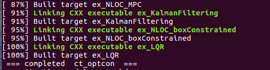
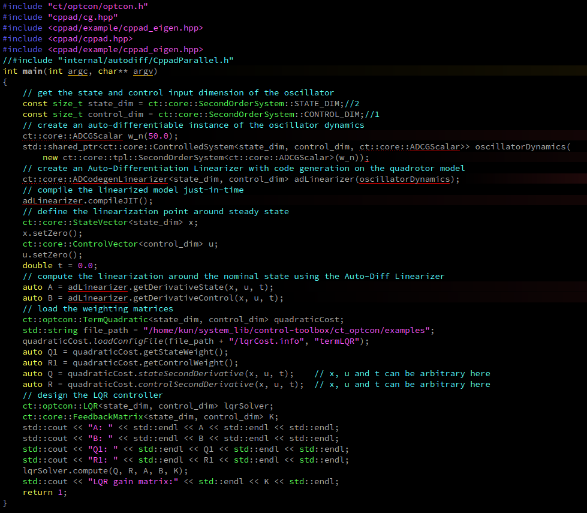
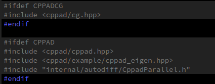
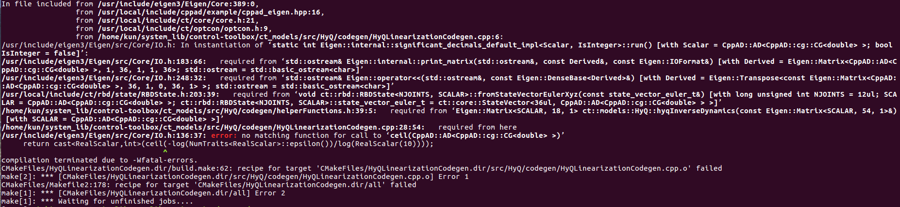

##1、关于roslaunch内容，
可以查看博客：https://blog.csdn.net/weixin_41995979/article/details/81784987
1.1 ros::init从参数服务器中获取参数。可以看get_param_from_rosparam.cpp
##2、gitpush:
git init
git add .
git commit -m "提交说明注释"
git remote add origin git@github.com:git的账号/learngit.git
本地第一次推送用-u
git push -u origin master
第一次推送失败可能是本地没有远程仓库的readme.md文件
git pull --rebase origin master
然后再继续推送
git push -u origin master
##3 rosrun rqt_tf_tree rosrun rqt_tf_tree
##4 ros::spin()和ros::spinonce()
https://www.cnblogs.com/liu-fa/p/5925381.html
##5 action_name
https://docs.ros.org/api/actionlib/html/classactionlib_1_1SimpleActionClient.html#details

##6、tf
在加载urdf时，各个关节的tf自动加载吗？
可以测试一下，rviz
Nope, robot_state_publisher

##7、ros_controllers
需要将基类中的虚函数在子类中实现，不然出现报错：
类似于：https://answers.ros.org/question/276638/rqt-custom-plugin-undefined-symbol/
没有这种类之类的
解决方式：https://www.youtube.com/watch?v=4xZKflNlJho

##8、realtime——tools
https://design.ros2.org/articles/realtime_background.html

##9、包安裝失敗：
https://www.codelast.com/%E5%8E%9F%E5%88%9B-%E8%A7%A3%E5%86%B3ubuntu-%E6%97%A0%E6%B3%95%E7%94%A8-apt-get-install-%E5%AE%89%E8%A3%85%E4%BB%BB%E4%BD%95%E8%BD%AF%E4%BB%B6dpkg-error-processing-package-xxx%E7%9A%84%E9%97%AE/

##10、关于control tolbox库安装失败
首先按照教程下载control toolbox，此时可以进行编译；
然后进行手动安装cppad和cppad，成功编译ex_LQR

但是几乎相同的代码，却并没有编译成功：

我在点击ct/optcon/optcon.h， 然后点击#ct/core/core.h时发现cppad和cppadcg是灰色的，这个不是很正常
    
    所以猜想是不是cppad和cppadcg的问题？（或许在执行的时候，cppad和cppadcg安装有先后顺序）而且在执行    
```
./build_ct.sh -DCMAKE_BUILD_TYPE=Release -DBUILD_EXAMPLES=true
```    

好像也是cppad的问题，而cppad的安装是按照指定教程进行安装的。其版本是20190200.4，而且我有安装llvm_version=6.0
我的gcc版本是5.4.0。如果你需要任何安装信息，请直接联系我。
